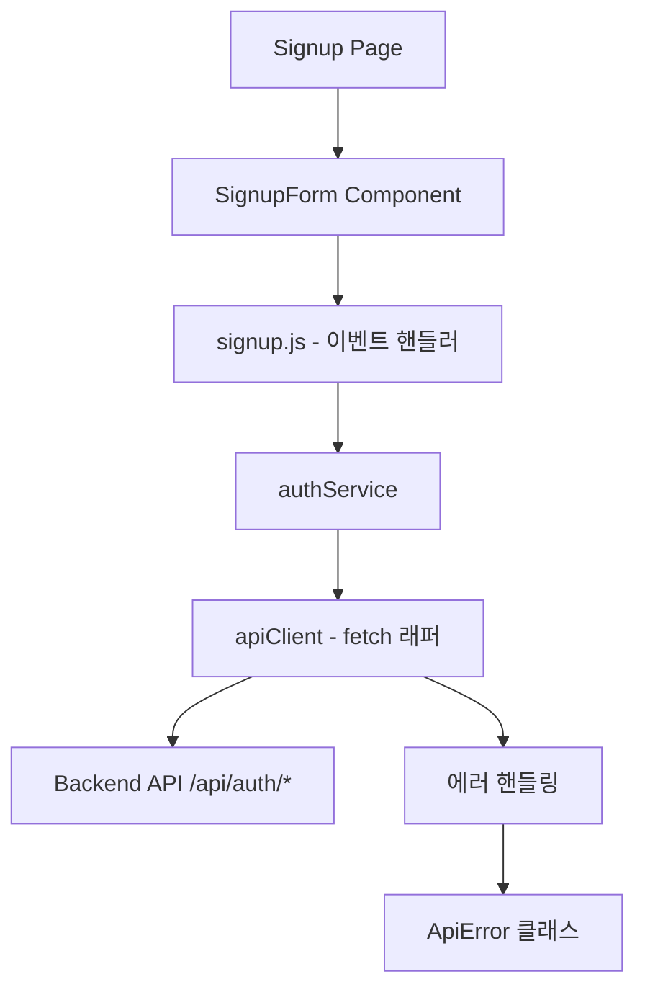
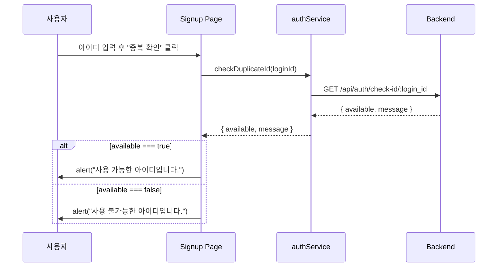
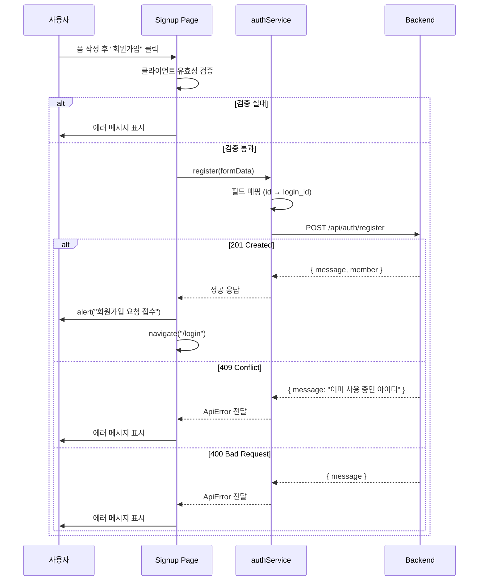

# 설계 문서: API 연동 - 회원가입

## 개요

프론트엔드 회원가입 페이지를 백엔드 REST API에 연동하는 기능이다. 현재 목(mock) 데이터로 동작하는 아이디 중복 확인과 회원가입 로직을 실제 API 호출로 교체한다. 중앙 집중식 API 서비스 레이어를 도입하여 fetch 래퍼, 에러 핸들링, 필드 매핑을 일관되게 처리한다.

이 설계는 향후 로그인, 민원 등록 등 다른 API 연동에도 재사용 가능한 기반 구조를 함께 구축한다.

## 아키텍처



### 디렉토리 구조

```
frontend/src/
├── services/
│   ├── apiClient.js      # fetch 래퍼 (baseURL, 헤더, 에러 처리)
│   └── authService.js    # 인증 관련 API 호출 함수
├── pages/
│   └── signup/
│       └── signup.js     # 기존 파일 수정 (API 호출 연결)
└── components/
    └── form/
        └── SignupForm.jsx # 변경 없음
```

## 시퀀스 다이어그램

### 아이디 중복 확인 흐름



### 회원가입 흐름



## 컴포넌트 및 인터페이스

### apiClient.js - HTTP 클라이언트 래퍼

**목적**: 모든 API 호출에 공통 설정(baseURL, 헤더, 에러 파싱)을 적용하는 fetch 래퍼

```javascript
// frontend/src/services/apiClient.js

const BASE_URL = '/api';

class ApiError extends Error {
  constructor(status, message) {
    super(message);
    this.status = status;
    this.name = 'ApiError';
  }
}

async function apiClient(endpoint, options = {}) {
  const url = `${BASE_URL}${endpoint}`;
  const config = {
    headers: { 'Content-Type': 'application/json' },
    ...options,
  };

  const token = localStorage.getItem('token');
  if (token) {
    config.headers.Authorization = `Bearer ${token}`;
  }

  const response = await fetch(url, config);

  if (!response.ok) {
    const body = await response.json().catch(() => ({}));
    throw new ApiError(response.status, body.message || '요청 처리 중 오류가 발생했습니다.');
  }

  return response.json();
}
```

**책임**:
- Base URL 자동 접두사 처리
- Content-Type 헤더 자동 설정
- JWT 토큰 자동 첨부 (존재 시)
- HTTP 에러 응답을 ApiError로 변환
- JSON 파싱 처리

### authService.js - 인증 서비스

**목적**: 인증 관련 API 호출을 캡슐화하고 프론트엔드-백엔드 간 필드 매핑 처리

```javascript
// frontend/src/services/authService.js

import apiClient, { ApiError } from './apiClient';

/**
 * 아이디 중복 확인
 * @param {string} loginId - 확인할 아이디
 * @returns {Promise<{available: boolean, message: string}>}
 */
export async function checkDuplicateId(loginId) {
  return apiClient(`/auth/check-id/${encodeURIComponent(loginId)}`);
}

/**
 * 회원가입
 * @param {Object} formData - 프론트엔드 폼 데이터
 * @param {string} formData.id - 아이디 (→ login_id로 매핑)
 * @param {string} formData.password
 * @param {string} formData.name
 * @param {string} formData.role - "C" | "E"
 * @param {string} formData.dept
 * @param {string} formData.phone
 * @returns {Promise<{message: string, member: Object}>}
 */
export async function register(formData) {
  const payload = {
    login_id: formData.id,
    password: formData.password,
    name: formData.name,
    role: formData.role,
    dept: formData.dept,
    phone: formData.phone,
  };

  return apiClient('/auth/register', {
    method: 'POST',
    body: JSON.stringify(payload),
  });
}
```

**책임**:
- 프론트엔드 필드명(`id`)을 백엔드 필드명(`login_id`)으로 매핑
- URL 인코딩 처리
- API 엔드포인트 경로 관리

## 데이터 모델

### 프론트엔드 폼 데이터 (기존)

```javascript
// 프론트엔드에서 사용하는 폼 상태
const formData = {
  id: "",           // 사번 (프론트엔드 필드명)
  password: "",
  name: "",
  role: "",         // "C" (사용자) | "E" (처리자)
  dept: "",
  phone: "",
};
```

### 백엔드 요청 페이로드

```javascript
// POST /api/auth/register 요청 바디
const registerPayload = {
  login_id: "",     // formData.id → login_id 매핑
  password: "",
  name: "",
  role: "",         // "C" | "E"
  dept: "",
  phone: "",
};
```

### 필드 매핑 규칙

| 프론트엔드 (formData) | 백엔드 (API payload) | 비고 |
|----------------------|---------------------|------|
| `id` | `login_id` | 유일한 매핑 필요 필드 |
| `password` | `password` | 동일 |
| `name` | `name` | 동일 |
| `role` | `role` | "C" 또는 "E" |
| `dept` | `dept` | 동일 |
| `phone` | `phone` | 동일 |

## 핵심 함수 상세 명세

### Function 1: apiClient()

```javascript
async function apiClient(endpoint, options = {})
```

**전제조건 (Preconditions)**:
- `endpoint`는 `/`로 시작하는 비어있지 않은 문자열
- `options.body`가 존재할 경우 JSON 직렬화 가능한 값

**후행조건 (Postconditions)**:
- HTTP 2xx 응답 시: 파싱된 JSON 객체 반환
- HTTP 4xx/5xx 응답 시: `ApiError` throw (status, message 포함)
- 네트워크 오류 시: 원본 Error throw

### Function 2: checkDuplicateId()

```javascript
async function checkDuplicateId(loginId)
```

**전제조건 (Preconditions)**:
- `loginId`는 비어있지 않은 문자열 (trim 후)

**후행조건 (Postconditions)**:
- 성공 시: `{ available: boolean, message: string }` 반환
- `available === true`: 사용 가능한 아이디
- `available === false`: 이미 존재하는 아이디
- 서버 오류 시: ApiError throw

### Function 3: register()

```javascript
async function register(formData)
```

**전제조건 (Preconditions)**:
- `formData.id`는 비어있지 않은 문자열
- `formData.password`는 비어있지 않은 문자열
- `formData.name`은 비어있지 않은 문자열
- `formData.role`은 "C" 또는 "E"
- `formData.dept`는 문자열 (처리자일 경우 필수)
- `formData.phone`은 문자열

**후행조건 (Postconditions)**:
- 201 응답 시: `{ message, member }` 반환
- 409 응답 시: ApiError(409, "이미 사용 중인 아이디입니다.") throw
- 400 응답 시: ApiError(400, message) throw
- `formData.id`가 `login_id`로 올바르게 매핑됨

## 알고리즘 의사코드

### 회원가입 처리 알고리즘

```pascal
ALGORITHM handleSignupSubmit(event, passwordConfirm)
INPUT: event (폼 제출 이벤트), passwordConfirm (비밀번호 확인 값)
OUTPUT: 성공 시 로그인 페이지 이동, 실패 시 에러 메시지 표시

BEGIN
  event.preventDefault()

  // Step 1: 중복 확인 여부 검증
  IF NOT idChecked THEN
    setError("아이디 중복 확인을 해주세요")
    RETURN
  END IF

  IF idAvailable = false THEN
    setError("사용 불가능한 아이디입니다")
    RETURN
  END IF

  // Step 2: 필수 필드 검증
  IF ANY OF (id, password, passwordConfirm, name, dept, phone) IS EMPTY THEN
    setError("모든 항목을 입력해주세요")
    RETURN
  END IF

  // Step 3: 비밀번호 일치 검증
  IF password ≠ passwordConfirm THEN
    setError("비밀번호가 일치하지 않습니다")
    RETURN
  END IF

  // Step 4: API 호출
  setLoading(true)
  TRY
    response ← authService.register(formData)
    alert(response.message)
    navigate("/login")
  CATCH error
    IF error.status = 409 THEN
      setError("이미 사용 중인 아이디입니다")
      setIdChecked(false)
      setIdAvailable(null)
    ELSE
      setError(error.message OR "회원가입 중 오류가 발생했습니다")
    END IF
  FINALLY
    setLoading(false)
  END TRY
END
```

### 아이디 중복 확인 알고리즘

```pascal
ALGORITHM handleCheckDuplicate()
INPUT: formData.id (입력된 아이디)
OUTPUT: 중복 확인 결과 표시

BEGIN
  // Step 1: 입력값 검증
  IF formData.id IS EMPTY THEN
    setError("아이디를 입력해주세요")
    RETURN
  END IF

  // Step 2: API 호출
  TRY
    result ← authService.checkDuplicateId(formData.id)
    
    IF result.available = true THEN
      alert("사용 가능한 아이디입니다.")
      setIdChecked(true)
      setIdAvailable(true)
    ELSE
      alert("사용 불가능한 아이디입니다.")
      setIdChecked(true)
      setIdAvailable(false)
    END IF
  CATCH error
    setError("중복 확인 중 오류가 발생했습니다")
  END TRY
END
```

## 사용 예시

```javascript
// 1. apiClient 사용 예시
import apiClient from '../services/apiClient';

// GET 요청
const result = await apiClient('/auth/check-id/hong001');
// → { available: true, message: "사용 가능한 아이디입니다." }

// POST 요청
const response = await apiClient('/auth/register', {
  method: 'POST',
  body: JSON.stringify({ login_id: 'hong001', password: 'test1234!', ... }),
});

// 2. authService 사용 예시 (signup.js에서)
import { checkDuplicateId, register } from '../../services/authService';

// 중복 확인
const { available, message } = await checkDuplicateId('hong001');

// 회원가입
try {
  const result = await register({
    id: 'hong001',        // → login_id로 자동 매핑
    password: 'test1234!',
    name: '홍길동',
    role: 'C',
    dept: '총무팀',
    phone: '010-1234-5678',
  });
  // result.message: "회원가입이 완료되었습니다. 관리자 승인 후 로그인 가능합니다."
} catch (error) {
  if (error.status === 409) {
    // 아이디 중복
  }
}
```

## 정확성 속성 (Correctness Properties)

*속성(Property)은 시스템의 모든 유효한 실행에서 참이어야 하는 특성 또는 동작이다. 속성은 사람이 읽을 수 있는 명세와 기계가 검증 가능한 정확성 보장 사이의 다리 역할을 한다.*

### Property 1: 필드 매핑 정확성 (Register Field Mapping)

*For any* 유효한 formData 객체에 대해, register() 함수가 생성하는 페이로드는 `login_id === formData.id`이고, password, name, role, dept, phone 필드는 formData의 동일 필드값과 일치해야 한다.

**Validates: Requirements 3.2, 3.3**

### Property 2: URL 인코딩 정확성 (URL Encoding)

*For any* 특수문자를 포함하는 loginId 문자열에 대해, checkDuplicateId() 함수가 호출하는 URL은 encodeURIComponent(loginId) 결과를 포함해야 한다.

**Validates: Requirement 2.2**

### Property 3: 인증 토큰 자동 첨부 (Token Auto-Attachment)

*For any* localStorage에 저장된 임의의 토큰 문자열에 대해, apiClient가 전송하는 요청의 Authorization 헤더는 `Bearer {token}` 형식이어야 한다.

**Validates: Requirement 1.3**

### Property 4: 에러 응답 추출 (Error Response Extraction)

*For any* 4xx 또는 5xx 상태 코드와 임의의 message 문자열을 가진 HTTP 응답에 대해, apiClient는 해당 status와 message를 포함하는 ApiError를 throw해야 한다.

**Validates: Requirement 1.6**

### Property 5: 빈 입력 중복 확인 차단 (Empty Input Blocks Duplicate Check)

*For any* 공백 문자로만 구성된 문자열(빈 문자열 포함)에 대해, handleCheckDuplicate는 API 호출을 수행하지 않고 에러 메시지를 설정해야 한다.

**Validates: Requirement 2.5**

### Property 6: 필수 필드 누락 시 API 호출 차단 (Missing Fields Block Submit)

*For any* 6개 필수 필드(id, password, passwordConfirm, name, dept, phone) 중 하나 이상이 비어있는(trim 후) formData에 대해, handleSubmit은 register API를 호출하지 않아야 한다.

**Validates: Requirement 4.3**

### Property 7: 비밀번호 불일치 시 API 호출 차단 (Password Mismatch Blocks Submit)

*For any* 서로 다른 두 문자열 password와 passwordConfirm에 대해, handleSubmit은 register API를 호출하지 않고 에러 메시지를 설정해야 한다.

**Validates: Requirement 4.4**

### Property 8: 로딩 상태 항상 해제 (Loading Always Resolves)

*For any* register API 호출 결과(성공, 4xx 에러, 5xx 에러, 네트워크 오류)에 대해, API 호출 완료 후 loading 상태는 반드시 false가 되어야 한다.

**Validates: Requirement 5.2**

### Property 9: 서버 에러 메시지 전달 (Server Error Message Passthrough)

*For any* 400 상태 응답에 포함된 임의의 message 문자열에 대해, Signup_Page는 해당 message를 그대로 사용자에게 표시해야 한다.

**Validates: Requirement 3.6**

## 에러 핸들링

### 에러 시나리오 1: 네트워크 오류

**조건**: 서버 연결 불가 (서버 다운, 네트워크 끊김)
**응답**: "회원가입 중 오류가 발생했습니다" 에러 메시지 표시
**복구**: 사용자가 재시도 가능 (loading 상태 해제)

### 에러 시나리오 2: 아이디 중복 (409)

**조건**: 이미 존재하는 login_id로 가입 시도
**응답**: "이미 사용 중인 아이디입니다" 에러 메시지 표시
**복구**: idChecked/idAvailable 상태 초기화, 사용자가 다른 아이디로 재시도

### 에러 시나리오 3: 필수 필드 누락 (400)

**조건**: 백엔드에서 필수 필드 누락 감지
**응답**: 서버 응답 메시지 그대로 표시
**복구**: 사용자가 누락 필드 입력 후 재시도

### 에러 시나리오 4: 서버 내부 오류 (500)

**조건**: 백엔드 서버 내부 오류
**응답**: "회원가입 중 오류가 발생했습니다" 일반 에러 메시지 표시
**복구**: 사용자가 잠시 후 재시도

## 테스트 전략

### 단위 테스트

- `apiClient`: 정상 응답 파싱, 에러 응답 시 ApiError throw, 토큰 자동 첨부 확인
- `authService.register`: 필드 매핑 정확성 (id → login_id)
- `authService.checkDuplicateId`: URL 인코딩 처리 확인

### 속성 기반 테스트

**라이브러리**: fast-check

- 임의의 문자열 id에 대해 register() 호출 시 항상 login_id로 매핑됨
- 임의의 특수문자 포함 loginId에 대해 checkDuplicateId()가 올바르게 인코딩됨

### 통합 테스트

- 중복 확인 → 회원가입 → 로그인 페이지 이동 전체 흐름
- 409 에러 시 상태 초기화 및 재시도 흐름

## 보안 고려사항

- 비밀번호는 HTTPS를 통해 전송 (프로덕션 환경)
- JWT 토큰은 localStorage에 저장 (API 문서 명세 준수)
- API 요청 시 사용자 입력값 URL 인코딩 처리 (XSS 방지)
- 에러 메시지에 민감한 서버 정보 노출 방지

## 의존성

- 외부 라이브러리 추가 없음 (네이티브 fetch API 사용)
- React 19.2.4 (기존)
- React Router v7 (기존)
