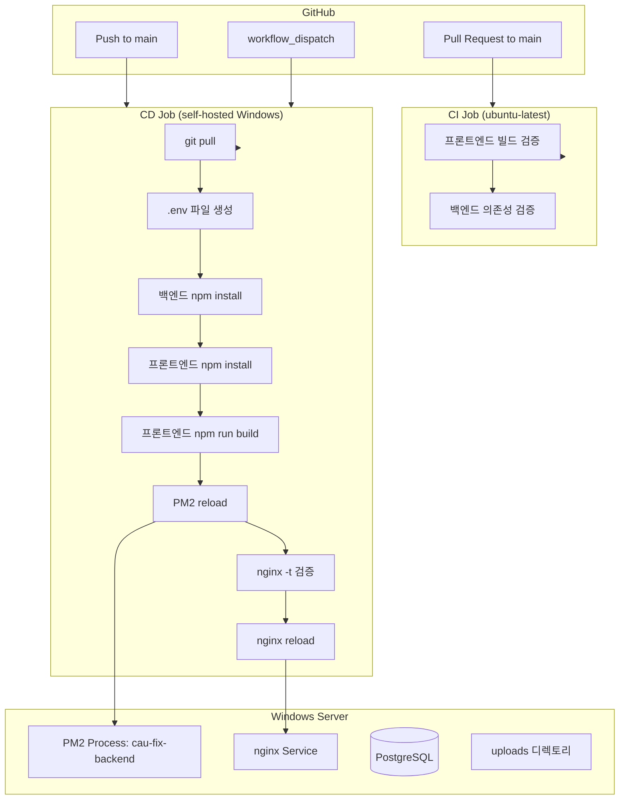

# Design Document: CI/CD Pipeline

## Overview

GitHub Actions 기반 CI/CD 파이프라인을 구축하여 풀스택 웹 애플리케이션(React + Express + PostgreSQL)을 self-hosted Windows 서버에 자동 배포하는 시스템을 설계한다.

**핵심 설계 결정:**
- CI는 `ubuntu-latest`에서 빌드/의존성 검증만 수행
- CD는 `self-hosted` Windows runner에서 직접 배포 (Docker 미사용)
- PM2로 백엔드 무중단 재시작, nginx로 프론트엔드 정적 파일 서빙
- GitHub Secrets를 통한 환경변수 관리

**배포 흐름:**
```
PR → CI 검증 → Merge → CD 배포 → 서비스 반영
```

## Architecture



### 트리거 조건

| 이벤트 | 실행 대상 | 설명 |
|--------|-----------|------|
| `pull_request` → main | CI Job | 코드 품질 검증 |
| `push` → main | CD Job | 자동 배포 |
| `workflow_dispatch` | CD Job | 수동 배포 |

## Components and Interfaces

### 1. GitHub Actions Workflow 파일

**파일 경로:** `.github/workflows/deploy.yml`

단일 워크플로우 파일에 CI와 CD를 모두 정의한다.

#### CI Job 구성

```yaml
ci:
  runs-on: ubuntu-latest
  timeout-minutes: 10
  steps:
    - checkout
    - Node.js 설정 (v18)
    - 프론트엔드: npm install → npm run build
    - 백엔드: npm install
```

**설계 근거:** CI는 격리된 환경에서 빌드 가능 여부만 검증하므로 GitHub 호스팅 러너를 사용한다. 타임아웃 10분으로 무한 대기를 방지한다.

#### CD Job 구성

```yaml
deploy:
  runs-on: self-hosted
  if: github.event_name == 'push' || github.event_name == 'workflow_dispatch'
  steps:
    - git pull
    - .env 생성 (GitHub Secrets)
    - 백엔드 의존성 설치
    - 프론트엔드 빌드
    - PM2 reload
    - nginx 설정 배포 및 reload
```

**설계 근거:** CD는 실제 배포 서버에서 실행되어야 하므로 self-hosted runner를 사용한다. `needs: ci` 조건 없이 독립 실행하여 push/dispatch 시 즉시 배포한다.

### 2. 환경변수 관리 컴포넌트

**인터페이스:**
- 입력: GitHub Secrets (DB_NAME, DB_USER, DB_PASSWORD, JWT_SECRET)
- 출력: `C:\Users\Administrator\Documents\cau-fix\cau-fix-web\.env` 파일

**검증 로직:**
```powershell
# 시크릿 값 존재 여부 검증
if ([string]::IsNullOrEmpty("${{ secrets.DB_NAME }}")) { exit 1 }
```

### 3. 서비스 관리 컴포넌트

#### PM2 관리
- 프로세스 이름: `cau-fix-backend`
- 재시작 명령: `pm2 reload cau-fix-backend`
- 자동 복구: PM2 기본 설정으로 비정상 종료 시 자동 재시작

#### nginx 관리
- 설정 파일 원본: `nginx/nginx.prod.conf`
- 배포 대상: Windows nginx 설정 경로
- 검증: `nginx -t` 성공 시에만 reload 실행

### 4. 데이터 보호 컴포넌트

배포 과정에서 보호해야 할 데이터:
- PostgreSQL 데이터베이스 (배포 스크립트에서 DB 조작 없음)
- `backend/uploads/` 디렉토리 (`.gitignore`에 포함)

## Data Models

### GitHub Actions Workflow 구조

```yaml
name: CI/CD Pipeline
on:
  pull_request:
    branches: [main]
  push:
    branches: [main]
  workflow_dispatch:

jobs:
  ci:
    # ubuntu-latest에서 빌드 검증
  deploy:
    # self-hosted에서 배포 실행
```

### 환경변수 파일 (.env)

```
DB_NAME=<from GitHub Secrets>
DB_USER=<from GitHub Secrets>
DB_PASSWORD=<from GitHub Secrets>
JWT_SECRET=<from GitHub Secrets>
```

**위치:** 프로젝트 루트 (`C:\Users\Administrator\Documents\cau-fix\cau-fix-web\.env`)
**로드 방식:** `dotenv.config({ path: path.resolve(__dirname, '../../.env') })` (기존 백엔드 코드)

### nginx 설정 구조 (프로덕션용 수정)

현재 `nginx/nginx.prod.conf`는 Docker 기반 설정(proxy_pass http://frontend:80, http://backend:3000)으로 되어 있다. self-hosted 배포에 맞게 수정이 필요하다:

```nginx
server {
    listen 80;
    server_name _;

    # 프론트엔드 정적 파일 직접 서빙
    location / {
        root C:/Users/Administrator/Documents/cau-fix/cau-fix-web/frontend/build;
        try_files $uri $uri/ /index.html;
    }

    # 백엔드 API 프록시
    location /api/ {
        proxy_pass http://127.0.0.1:3000;
        proxy_http_version 1.1;
        proxy_set_header Host $http_host;
        proxy_set_header X-Real-IP $remote_addr;
        proxy_set_header X-Forwarded-For $proxy_add_x_forwarded_for;
        proxy_set_header X-Forwarded-Proto $scheme;
    }

    # 업로드 파일 프록시
    location /uploads/ {
        proxy_pass http://127.0.0.1:3000;
        proxy_http_version 1.1;
        proxy_set_header Host $http_host;
        proxy_set_header X-Real-IP $remote_addr;
        proxy_set_header X-Forwarded-For $proxy_add_x_forwarded_for;
        proxy_set_header X-Forwarded-Proto $scheme;
    }
}
```

**설계 근거:** Docker를 사용하지 않으므로 컨테이너 이름(frontend, backend) 대신 localhost와 파일 시스템 경로를 직접 참조한다.

## Correctness Properties

이 기능은 Property-Based Testing(PBT)이 적합하지 않아 Correctness Properties 섹션을 생략한다.

**PBT 미적용 사유:**

1. **Infrastructure as Code (IaC) 특성**: GitHub Actions 워크플로우는 선언적 YAML 구성으로, 입력/출력이 있는 순수 함수가 아니다.
2. **외부 서비스 오케스트레이션**: 모든 동작이 외부 서비스(git, PM2, nginx, npm)와의 상호작용에 의존하며, 입력에 따라 동작이 의미 있게 변하지 않는다.
3. **셸 스크립트 기반**: PowerShell 스크립트는 시스템 상태를 변경하는 부수 효과(side-effect) 중심 코드로, "모든 입력 X에 대해 속성 P(X)가 성립한다"는 형태의 보편적 속성을 정의할 수 없다.
4. **비용 대비 효과 부족**: 100회 반복 실행이 2-3회 실행보다 더 많은 버그를 발견하지 못한다.

**대안적 검증 방법:**

| 검증 유형 | 대상 | 방법 |
|-----------|------|------|
| Smoke Test | YAML 문법 유효성 | `actionlint` 정적 분석 |
| Integration Test | CI/CD 파이프라인 전체 흐름 | PR 생성 → CI 실행, push → CD 배포 확인 |
| Schema Validation | 워크플로우 구조 | GitHub Actions 스키마 검증 |
| Manual Verification | 배포 결과 | 서비스 상태 확인, 헬스체크 엔드포인트 |
| Failure Scenario Test | 오류 복구 | 의도적 실패 주입 후 기존 서비스 유지 확인 |

## Error Handling

### CI Job 실패 처리

| 실패 시나리오 | 동작 | 영향 |
|--------------|------|------|
| 프론트엔드 빌드 실패 | CI 체크 실패 → PR 머지 차단 | 배포 없음 |
| 백엔드 의존성 설치 실패 | CI 체크 실패 → PR 머지 차단 | 배포 없음 |
| 타임아웃 (10분 초과) | 단계 실패 처리 | 배포 없음 |

### CD Job 실패 처리

| 실패 시나리오 | 동작 | 서비스 영향 |
|--------------|------|------------|
| git pull 실패 | 워크플로우 중단 | 기존 서비스 유지 |
| 시크릿 누락 | 배포 중단, 오류 메시지 출력 | 기존 서비스 유지 |
| npm install 실패 | 워크플로우 중단 | 기존 PM2 프로세스 유지 |
| npm run build 실패 | 워크플로우 중단 | 기존 서비스 유지 |
| PM2 reload 실패 | 워크플로우 중단 | PM2 자동 복구 시도 |
| nginx -t 실패 | nginx reload 스킵 | 기존 nginx 설정 유지 |

### 핵심 안전 원칙

1. **순차 실행 + 즉시 중단**: 각 단계는 이전 단계 성공 후에만 실행. 실패 시 후속 단계 실행하지 않음
2. **기존 서비스 보호**: npm install 실패 시 PM2 프로세스를 건드리지 않아 서비스 가용성 유지
3. **nginx 안전 배포**: `nginx -t` 검증 실패 시 reload하지 않아 기존 설정 보존
4. **데이터 무결성**: 배포 스크립트에 DB 조작 명령 없음, uploads 디렉토리 .gitignore로 보호

### 시크릿 검증 전략

```powershell
# 배포 시작 전 시크릿 존재 여부 확인
$secrets = @{
    "DB_NAME" = "${{ secrets.DB_NAME }}"
    "DB_USER" = "${{ secrets.DB_USER }}"
    "DB_PASSWORD" = "${{ secrets.DB_PASSWORD }}"
    "JWT_SECRET" = "${{ secrets.JWT_SECRET }}"
}

foreach ($key in $secrets.Keys) {
    if ([string]::IsNullOrEmpty($secrets[$key])) {
        Write-Error "Missing secret: $key"
        exit 1
    }
}
```

## Testing Strategy

### PBT 미적용 사유

이 기능은 GitHub Actions 워크플로우 YAML 구성, 셸 스크립트, 외부 서비스 오케스트레이션(PM2, nginx, git)으로 구성된다. 순수 함수나 데이터 변환 로직이 없으며, 모든 동작이 외부 서비스와의 상호작용에 의존하므로 Property-Based Testing이 적합하지 않다.

### 테스트 전략

#### 1. YAML 문법 검증 (Smoke Test)
- GitHub Actions 워크플로우 YAML 파일의 문법 유효성 검증
- `actionlint` 또는 GitHub의 워크플로우 검증 기능 활용

#### 2. 통합 테스트 (수동 검증)
- **CI 검증**: PR 생성 시 CI Job이 정상 실행되는지 확인
- **CD 검증**: main 브랜치 push 시 배포가 정상 완료되는지 확인
- **수동 배포**: workflow_dispatch로 수동 배포 트리거 확인

#### 3. 실패 시나리오 테스트
- 의도적으로 빌드 에러를 포함한 PR로 CI 실패 확인
- 시크릿 미설정 상태에서 배포 시도하여 오류 메시지 확인
- 잘못된 nginx 설정으로 `nginx -t` 실패 시 기존 설정 유지 확인

#### 4. 서비스 상태 확인
- 배포 후 `/health` 엔드포인트 응답 확인
- PM2 프로세스 상태 확인 (`pm2 status`)
- nginx 서비스 상태 확인

#### 5. 데이터 영속성 확인
- 배포 전후 DB 데이터 비교
- 배포 전후 uploads 디렉토리 파일 목록 비교
