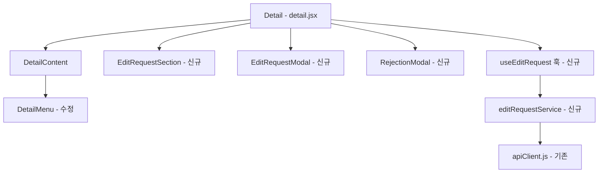
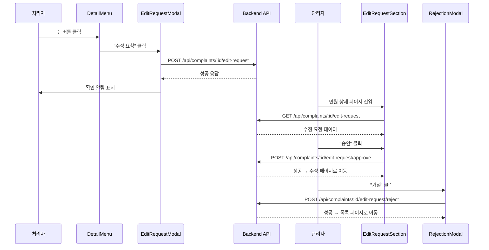

# 기술 설계 문서: 민원 수정 요청 (complaint-edit-request)

## Overview

처리자가 민원 상세 페이지에서 수정 요청을 제출하고, 관리자가 해당 요청을 승인/거절할 수 있는 프론트엔드 기능을 설계한다. 기존 `Detail` 컴포넌트 계층 구조에 수정 요청 모달, 수정 요청 확인 섹션, 거절 모달을 추가하며, 기존 `complainService.js` 패턴을 따라 API 통합을 구현한다.

### 핵심 설계 결정

1. **기존 컴포넌트 확장**: 새로운 페이지를 만들지 않고 기존 `Detail` 컴포넌트에 수정 요청 관련 상태와 UI를 추가한다.
2. **커스텀 훅 분리**: 수정 요청 관련 상태 관리를 `useEditRequest` 커스텀 훅으로 분리하여 `detail.jsx`의 복잡도를 관리한다.
3. **기존 API 패턴 준수**: `apiClient.js`의 `ApiError` 패턴과 `complainService.js`의 서비스 함수 패턴을 그대로 따른다.
4. **모달 컴포넌트 재사용**: 기존 `ConfirmPopup`, `FormPopup` 패턴을 참고하여 일관된 모달 UI를 구현한다.

## Architecture

### 컴포넌트 계층 구조



### 상태 흐름



## Components and Interfaces

### 1. EditRequestModal (신규 컴포넌트)

**파일 경로**: `frontend/src/components/detail/EditRequestModal.jsx`

```jsx
/**
 * 수정 요청 사유 입력 모달
 * @param {boolean} isOpen - 모달 표시 여부
 * @param {function} onClose - 모달 닫기 콜백
 * @param {number} complaintId - 민원 ID
 * @param {string} currentCategory - 현재 민원 카테고리 (제외 대상)
 * @param {function} onSuccess - 제출 성공 콜백
 */
```

**Props Interface**:
| Prop | Type | Description |
|------|------|-------------|
| isOpen | boolean | 모달 표시 여부 |
| onClose | () => void | 모달 닫기 |
| complaintId | number | 민원 ID |
| currentCategory | string | 현재 카테고리명 |
| onSuccess | () => void | 제출 성공 시 콜백 |

**내부 상태**:
- `reasonType`: `null | "담당자 변경" | "카테고리 변경 요청" | "기타"`
- `selectedCategory`: `null | { category_id, category_name }`
- `otherReason`: `string`
- `submitting`: `boolean`
- `error`: `string | null`

### 2. EditRequestSection (신규 컴포넌트)

**파일 경로**: `frontend/src/components/detail/EditRequestSection.jsx`

```jsx
/**
 * 관리자 민원 상세 페이지 - 수정 요청 확인 영역
 * @param {Object} editRequest - 수정 요청 데이터
 * @param {boolean} isAdmin - 관리자 여부
 * @param {boolean} approving - 승인 API 진행 중
 * @param {function} onApprove - 승인 버튼 클릭 콜백
 * @param {function} onReject - 거절 버튼 클릭 콜백
 */
```

**Props Interface**:
| Prop | Type | Description |
|------|------|-------------|
| editRequest | Object \| null | 수정 요청 데이터 |
| isAdmin | boolean | 관리자 여부 |
| approving | boolean | 승인 처리 중 여부 |
| onApprove | () => void | 승인 클릭 |
| onReject | () => void | 거절 클릭 |

### 3. RejectionModal (신규 컴포넌트)

**파일 경로**: `frontend/src/components/detail/RejectionModal.jsx`

```jsx
/**
 * 관리자 거절 사유 입력 모달
 * @param {boolean} isOpen - 모달 표시 여부
 * @param {function} onClose - 모달 닫기 (취소)
 * @param {number} complaintId - 민원 ID
 * @param {function} onSuccess - 거절 성공 콜백
 */
```

**Props Interface**:
| Prop | Type | Description |
|------|------|-------------|
| isOpen | boolean | 모달 표시 여부 |
| onClose | () => void | 취소 시 닫기 |
| complaintId | number | 민원 ID |
| onSuccess | () => void | 거절 성공 시 콜백 |

**내부 상태**:
- `reason`: `string`
- `submitting`: `boolean`
- `error`: `string | null`

### 4. useEditRequest 커스텀 훅 (신규)

**파일 경로**: `frontend/src/hooks/useEditRequest.js`

```jsx
/**
 * 수정 요청 관련 상태 관리 훅
 * @param {number|null} complaintId - 민원 ID
 * @returns {Object} 수정 요청 상태 및 액션
 */
export default function useEditRequest(complaintId) {
  return {
    editRequest,      // Object|null - 현재 수정 요청 데이터
    loading,          // boolean - 조회 로딩 상태
    error,            // string|null - 조회 에러
    approving,        // boolean - 승인 처리 중
    approve,          // () => Promise<void> - 승인 실행
    refetch,          // () => Promise<void> - 재조회
  };
}
```

### 5. DetailMenu 수정

**파일 경로**: `frontend/src/components/detail/DetailMenu.jsx`

기존 처리자 메뉴에서 `fromStorage` 조건에 추가로 민원 상태가 "접수중" 또는 "진행중"인 경우에만 "수정 요청" 메뉴를 표시하도록 수정한다. 현재 코드에서는 `fromStorage`가 true이면 무조건 "수정 요청"을 표시하고 있으므로, 상태 조건을 추가한다.

### 6. editRequestService (신규 서비스)

**파일 경로**: `frontend/src/services/editRequestService.js`

```javascript
import apiClient from './apiClient';

export async function submitEditRequest(complaintId, { reasonType, detail }) { ... }
export async function getEditRequest(complaintId) { ... }
export async function approveEditRequest(complaintId) { ... }
export async function rejectEditRequest(complaintId, { reason }) { ... }
```

## Data Models

### 수정 요청 제출 Payload

```javascript
// POST /api/complaints/:id/edit-request
{
  reasonType: "담당자 변경" | "카테고리 변경 요청" | "기타",
  detail: string  // 카테고리명 또는 기타 사유 텍스트
}
```

### 수정 요청 조회 Response

```javascript
// GET /api/complaints/:id/edit-request
{
  editRequest: {
    id: number,
    complaintId: number,
    reasonType: "담당자 변경" | "카테고리 변경 요청" | "기타",
    detail: string,
    status: "pending" | "approved" | "rejected",
    createdAt: string,  // ISO 8601
    handlerId: number,
    handlerName: string
  } | null
}
```

### 거절 요청 Payload

```javascript
// POST /api/complaints/:id/edit-request/reject
{
  reason: string  // 거절 사유 (1~500자)
}
```

### 폼 유효성 검증 규칙

| 사유 타입 | 추가 입력 | 유효 조건 |
|-----------|-----------|-----------|
| 담당자 변경 | 없음 | 라디오 선택만으로 유효 |
| 카테고리 변경 요청 | 카테고리 드롭다운 | 카테고리 선택 필수 |
| 기타 | 텍스트 입력 | 1자 이상 비공백 문자, 최대 500자 |

## Correctness Properties

*A property is a characteristic or behavior that should hold true across all valid executions of a system-essentially, a formal statement about what the system should do. Properties serve as the bridge between human-readable specifications and machine-verifiable correctness guarantees.*

### Property 1: 메뉴 항목 표시 규칙

*For any* 조합 (complaintStatus, userRole, isInProcessingList)에 대해:
- userRole이 "처리자"이고 isInProcessingList가 true이고 complaintStatus가 "접수중" 또는 "진행중"인 경우에만 "수정 요청" 메뉴가 표시되어야 한다.
- userRole이 "처리자"이고 isInProcessingList가 false인 경우 "내 처리현황에 추가" 메뉴가 표시되어야 한다.
- 그 외의 경우 "수정 요청" 메뉴는 표시되지 않아야 한다.

**Validates: Requirements 1.1, 1.2, 1.4**

### Property 2: 수정 요청 폼 유효성 검증

*For any* 폼 상태 (reasonType, selectedCategory, otherReason)에 대해, 제출 버튼은 다음 조건을 모두 만족할 때만 활성화되어야 한다:
- reasonType이 null이 아닐 것
- reasonType이 "카테고리 변경 요청"이면 selectedCategory가 null이 아닐 것
- reasonType이 "기타"이면 otherReason.trim().length가 1 이상이고 500 이하일 것
- reasonType이 "담당자 변경"이면 추가 조건 없음

**Validates: Requirements 2.5, 2.6, 2.7**

### Property 3: 카테고리 필터링

*For any* 카테고리 목록과 현재 민원 카테고리에 대해, 카테고리 변경 요청 드롭다운에 표시되는 카테고리 목록은 현재 카테고리를 제외한 전체 카테고리와 정확히 일치해야 한다.

**Validates: Requirements 2.2**

### Property 4: 라디오 옵션 변경 시 상세 내용 초기화

*For any* 이전 선택 상태 (previousReasonType, previousDetail)와 새로운 선택 (newReasonType)에 대해, previousReasonType ≠ newReasonType이면 상세 내용(selectedCategory, otherReason)이 초기 상태로 리셋되어야 한다.

**Validates: Requirements 8.2**

### Property 5: API 실패 시 폼 데이터 보존

*For any* 유효한 폼 상태에서 API 호출이 실패한 경우, 폼에 입력된 데이터(reasonType, selectedCategory, otherReason)는 실패 전과 동일하게 유지되어야 하며, 모달은 닫히지 않아야 한다.

**Validates: Requirements 3.4, 6.7**

### Property 6: 수정 요청 섹션 표시 규칙

*For any* 조합 (editRequest, userRole)에 대해:
- editRequest가 null이면 EditRequestSection이 렌더링되지 않아야 한다.
- editRequest가 존재하면 요청 사유, 상세 내용, 제출 시간이 표시되어야 한다.
- editRequest가 존재하고 userRole이 "관리자"이면 "승인"과 "거절" 버튼이 표시되어야 한다.
- editRequest가 존재하고 userRole이 "관리자"가 아니면 버튼이 숨겨져야 한다.

**Validates: Requirements 4.1, 4.2, 4.3, 4.5**

### Property 7: 거절 사유 유효성 검증

*For any* 문자열 reason에 대해, "완료" 버튼은 reason.trim().length가 1 이상이고 500 이하일 때만 활성화되어야 한다.

**Validates: Requirements 6.3**

## Error Handling

### API 에러 처리 전략

| 시나리오 | HTTP 상태 | 프론트엔드 동작 |
|----------|-----------|-----------------|
| 수정 요청 제출 실패 | 4xx/5xx | 모달 유지, 에러 메시지 표시, 폼 데이터 보존 |
| 수정 요청 조회 실패 | 4xx/5xx | 에러 메시지 표시, 섹션 미표시 |
| 승인 실패 | 4xx/5xx | 에러 메시지 표시, 버튼 재활성화 |
| 승인 충돌 | 409 | "이미 처리된 요청" 메시지, 섹션 새로고침 |
| 거절 실패 | 4xx/5xx | 모달 유지, 에러 메시지 표시, 입력 데이터 보존 |
| 카테고리 조회 실패 | 4xx/5xx | 드롭다운에 에러 상태 표시 |

### 에러 메시지 표시 패턴

기존 프로젝트의 `alert()` 패턴 대신, 모달 내부에 인라인 에러 메시지를 표시한다:

```jsx
{error && <p className="edit-request-error">{error}</p>}
```

### 중복 요청 방지

- `submitting` 상태를 사용하여 API 호출 중 버튼을 비활성화
- 버튼 클릭 핸들러에서 `submitting` 상태를 먼저 확인하여 이중 호출 방지

## Testing Strategy

### 테스트 프레임워크

- **단위 테스트**: Jest + React Testing Library (react-scripts에 포함)
- **속성 기반 테스트**: fast-check (이미 devDependencies에 설치됨)

### 속성 기반 테스트 (Property-Based Tests)

각 Correctness Property에 대해 fast-check를 사용한 속성 기반 테스트를 작성한다.

- 최소 100회 반복 실행
- 각 테스트에 설계 문서의 Property 번호를 태그로 포함
- 태그 형식: `Feature: complaint-edit-request, Property {number}: {property_text}`

**테스트 대상 함수 분리**:
- `isEditRequestMenuVisible(status, role, isInProcessingList)` → Property 1
- `isEditRequestFormValid(reasonType, selectedCategory, otherReason)` → Property 2
- `filterCategories(allCategories, currentCategory)` → Property 3
- `resetDetailOnReasonChange(prevType, newType, state)` → Property 4
- `preserveFormOnError(formState, error)` → Property 5
- `getEditRequestSectionVisibility(editRequest, userRole)` → Property 6
- `isRejectionReasonValid(reason)` → Property 7

### 단위 테스트 (Example-Based Tests)

| 테스트 대상 | 검증 내용 |
|-------------|-----------|
| EditRequestModal 초기 상태 | 라디오 미선택, 버튼 비활성화 |
| EditRequestModal 라디오 선택 | 각 옵션별 추가 UI 표시 |
| EditRequestModal 제출 성공 | 모달 닫힘, 알림 표시 |
| EditRequestSection 렌더링 | 요청 정보 올바르게 표시 |
| RejectionModal 취소 | API 호출 없이 닫힘 |
| RejectionModal 제출 성공 | 목록 페이지로 이동 |
| 승인 성공 | 수정 페이지로 이동 |
| 승인 충돌 (409) | 에러 메시지 + 섹션 새로고침 |

### 통합 테스트

| 테스트 대상 | 검증 내용 |
|-------------|-----------|
| 알림 생성 (승인) | 신고자와 처리자에게 알림 전달 |
| 알림 생성 (거절) | 처리자에게 거절 알림 전달 |
| 알림 생성 (제출) | 관리자에게 수정 요청 알림 전달 |

